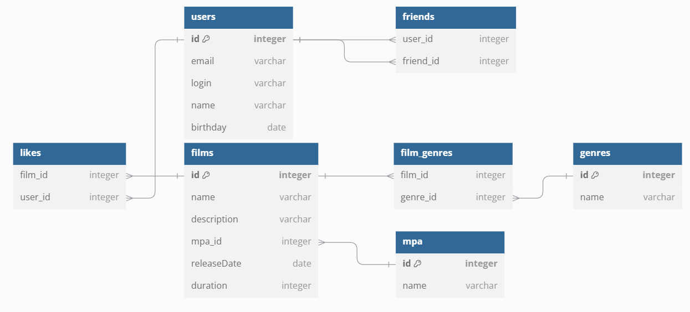

# java-filmorate
Template repository for Filmorate project.

Схема БД фильмов

- SELECT * FROM films; --получение всех фильмов
- SELECT * FROM users; --получение всех пользователей
- SELECT COUNT(user_id) FROM likes WHERE film_id = :film_is; --получение количества лайков фильма